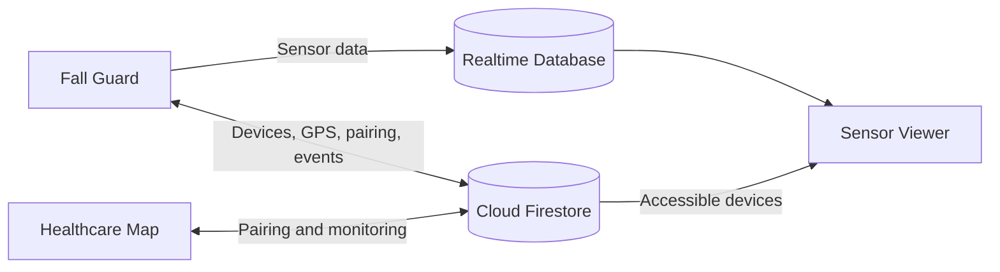

# Fall Guard — Fall Detection and GPS Monitoring System

This project includes a monitoring app for people at risk of falling, a companion app for family members, and a sensor data viewer. The applications are written in TypeScript, use Firebase for data synchronization, and use Capacitor to package the two main apps for Android.

## Components

| Directory | Role | Features implemented in the source code |
| --- | --- | --- |
| [`fall-guard-app`](./fall-guard-app) | App on the monitored device | Sensor readings, acceleration threshold detection, alert cancellation countdown, GPS and battery synchronization, guardian pairing, and sensor streaming |
| [`healthcare-map`](./healthcare-map) | Companion app for guardians | Device pairing, location tracking on Google Maps, directions, device status, fall event history, and audible alerts |
| [`sensor-viewer`](./sensor-viewer) | Web tool for sensor visualization | Real-time accelerometer and gyroscope charts, and CSV export |

Both main apps include registration, login, password recovery, and registration OTP delivery through EmailJS. Device pairing uses a 12-digit device ID and a 6-digit verification code, handled separately from email OTPs.

## Repository Status

**The current clone does not include all assets required to run the complete interface.** Restore the following components before running a demo or packaging an APK:

- Each application's `www/` directory, including `index.html`, CSS, and UI assets. This directory is excluded by `.gitignore`; the build command generates only `www/app.js`, not HTML or CSS.
- Custom Android native implementations. The TypeScript code includes bridges to the `FallGuardSensor` and `AlarmSound` plugins, but their native implementations are absent from the repository. Running `cap add android` creates a basic Android project without restoring these plugins.
- Firebase access rules. The repository does not include rule files or the `FIREBASE-SETUP.md` document referenced by the existing guides.

The `confirmFallWithAI()` function is currently a **mock implementation**: it confirms candidates that exceed the acceleration threshold and derives a score from peak acceleration. No trained AI model is integrated. Monitoring with the screen off depends on the missing native implementation.

## Technology Stack

| Technology | Purpose |
| --- | --- |
| TypeScript 5.x | Application logic and data types |
| esbuild | Bundling source code into `www/app.js` |
| Capacitor 7 | Android wrappers for Fall Guard and Healthcare Map |
| Firebase Authentication | Account authentication |
| Cloud Firestore | Profiles, devices, pairing, and fall events |
| Firebase Realtime Database | Live sensor data streaming |
| EmailJS REST API | Registration OTP delivery by email |
| Google Maps | Embedded maps and directions links |
| Canvas API | Sensor charts |

## Data Flow



The source code uses the following main data paths:

| Service | Path | Contents |
| --- | --- | --- |
| Firestore | `users/{uid}` | User profiles |
| Firestore | `devices/{deviceId}` | Device owner, guardians, location, battery, and status |
| Firestore | `devices/{deviceId}/events/{eventId}` | Fall events |
| Firestore | `devices/{deviceId}/requests/{guardianUid}` | Pairing requests |
| Firestore | `guardians/{uid}/links/{deviceId}` | Devices followed by a guardian |
| Realtime Database | `live/{deviceId}/meta` | Sensor stream status |
| Realtime Database | `live/{deviceId}/chunks` | Batches of accelerometer and gyroscope samples |

## Prerequisites and Installation

- Git, Node.js 20 or later, and npm.
- For Android builds: Android Studio Ladybug 2024.2.1 or later, JDK 21, and Android SDK 35, as specified in the [Capacitor 7 requirements](https://capacitorjs.com/docs/updating/7-0).
- A Firebase project and an EmailJS service for the corresponding features.
- The missing assets described in **Repository Status**.

```bash
git clone https://github.com/TuanNguyn-11/Di_dong_Android.git
cd Di_dong_Android
```

Each application directory is an independent package. Install dependencies inside each directory you intend to use:

```bash
cd fall-guard-app
npm ci
```

Repeat for `healthcare-map` and `sensor-viewer` as needed.

## Service Configuration

### Firebase

1. Set up Firebase Authentication with Email/Password, Cloud Firestore, and Realtime Database if you need live sensor charts.
2. Configure both apps to use the same Firebase project in [`fall-guard-app/src/firebase-config.ts`](./fall-guard-app/src/firebase-config.ts) and [`healthcare-map/src/firebase-config.ts`](./healthcare-map/src/firebase-config.ts).
3. Set `databaseURL` in the Fall Guard configuration to enable sensor streaming. Sensor Viewer imports this configuration directly from Fall Guard and does not require a separate configuration.
4. Configure access rules for device owners and paired guardians using the data paths above. Client configuration alone does not grant database access.

The existing files contain configuration for an existing project. Replace it with a project you manage when setting up your own deployment. Healthcare Map currently leaves `databaseURL` as a placeholder and primarily uses Firestore.

### EmailJS

In both main applications' `firebase-config.ts` files, update `emailjsConfig` with your service's `serviceId`, `templateId`, and `publicKey`.

Email templates can use the variables supplied by `src/emailjs.ts`: `to_email`, `to_name`, `otp`, `expire_minutes`, `time`, and `app_name`. The code also supplies alternative names such as `email`, `passcode`, and `code`.

## Checking and Running the Web Apps

Run these commands inside an application directory after installing its dependencies:

```bash
npm run typecheck
npm run build
```

The `build` script checks TypeScript types and bundles the JavaScript. To open the interface, **first restore `www/index.html`, CSS, and the required assets**, then run:

```bash
npm run serve
```

| Application | Default address |
| --- | --- |
| Fall Guard | `http://localhost:5173` |
| Healthcare Map | `http://localhost:5173` |
| Sensor Viewer | `http://localhost:5180` |

Both main apps use the same default port. To run them simultaneously, keep Fall Guard on port 5173 and run the following command inside `healthcare-map`:

```bash
npx --yes http-server www -p 5174 -c-1
```

During development, run `npm run watch` in a separate terminal to rebuild the bundle whenever the source changes. Serve the apps over HTTP on localhost instead of opening HTML through `file://`.

## Android Builds

These steps apply to `fall-guard-app` and `healthcare-map` after restoring their UI assets. Run the commands inside the relevant application directory:

```bash
npm run build
npm run add:android
npm run sync
npm run open:android
```

Run `add:android` only when the `android/` directory does not already exist. To use custom native features, restore and register the corresponding plugins; the commands above do not generate them.

Fall Guard's native bridge also supports location and battery plugins. Install versions matching the project's Capacitor major version:

```bash
npm install @capacitor/geolocation@7 @capacitor/device@7
npm run sync
```

Add location permissions inside the `manifest` element in `android/app/src/main/AndroidManifest.xml`:

```xml
<uses-permission android:name="android.permission.ACCESS_FINE_LOCATION" />
<uses-permission android:name="android.permission.ACCESS_COARSE_LOCATION" />
```

Once the Android project is ready, build a debug APK on Windows:

```bash
npm run apk
```

The output APK is located relative to the application directory at:

```text
android/app/build/outputs/apk/debug/app-debug.apk
```

The `apk` script uses `gradlew.bat`. On macOS/Linux, run `npm run sync`, change into `android/`, and run `./gradlew assembleDebug`.

## Demo Workflow After Setup

1. Register and sign in to Fall Guard on the monitored device.
2. Sign in to Healthcare Map using a guardian account.
3. Enter the 12-digit device ID and the 6-digit pairing code from Fall Guard. Keep Fall Guard active so it can process the request.
4. Enable monitoring, grant location access, and check the device data in Healthcare Map.
5. Use the simulated fall feature to test the countdown, cancel or send an alert, and check the event history in the guardian app.
6. Enable sensor streaming in Fall Guard. Sign in to Sensor Viewer with an account authorized to view the device, then inspect the charts and export CSV data.

## Related Documentation

- [Fall Guard Android guide](./fall-guard-app/README-ANDROID.md)
- [Healthcare Map Android guide](./healthcare-map/README-ANDROID.md)

Some details in these guides do not match the current repository, including older Node/JDK requirements, references to `FIREBASE-SETUP.md`, and Android assets that are not tracked in Git. Use this README's prerequisites and repository status when preparing a fresh clone.
