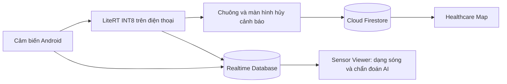

# Fall Guard — Phát hiện té ngã bằng AI và theo dõi GPS

Hệ thống gồm ứng dụng Android cho người được theo dõi, ứng dụng cho người thân
và website quan sát cảm biến/chẩn đoán AI. Mã ứng dụng sử dụng TypeScript,
Capacitor 7 và Firebase; model INT8 chạy trực tiếp trên điện thoại bằng LiteRT.

## Thành phần

| Thư mục | Chức năng |
| --- | --- |
| [fall-guard-app](fall-guard-app/) | Cảm biến, suy luận AI native, chuông/rung, đếm ngược hủy cảnh báo, GPS, pin và ghép người thân |
| [healthcare-map](healthcare-map/) | Ghép thiết bị, xem vị trí/bản đồ, trạng thái và lịch sử cảnh báo |
| [sensor-viewer](sensor-viewer/) | Biểu đồ 6 trục, xuất CSV, tab Chẩn đoán AI và xuất bằng chứng JSON |
| [model-AI](model-AI/) | Model `.tflite`, thông số chuẩn hóa, golden vectors và gói bàn giao firmware ESP32 |

Repo chứa HTML/CSS trong `www/`, mã Java và project Android tùy chỉnh của hai
ứng dụng. Không cần khôi phục những thư mục này từ nguồn khác. `www/app.js`,
dependencies, APK, log kiểm thử và cấu hình SDK cục bộ được sinh lại khi build.

## Luồng hoạt động



AI sử dụng `dilated_aug_s0_int8.tflite` với đầu vào `int8 [1,50,6]`:

- Thứ tự kênh: `AccX, AccY, AccZ, GyrX, GyrY, GyrZ`.
- Lưới dữ liệu 100 Hz, cửa sổ 50 mẫu; suy luận mỗi 10 mẫu mới.
- Gia tốc có trọng lực, đổi sang `g`; gyro đổi sang độ/giây.
- Chuẩn hóa bằng mean/std của model, clipping và lượng tử hóa INT8.
- Output là logits; giải lượng tử và sigmoid để tính xác suất té ngã.
- Ngưỡng `p >= 0,7` trong hai cửa sổ liên tiếp tạo ứng viên cảnh báo.
- Khi bật giám sát, xác minh SHA-256, tensor và 10 golden vector trước khi chạy.

Model SHA-256:
`436a3463ee4802aa960c777775b680d3f9fc50a1c5798b0204a5c8c91dff0f11`.
Chi tiết: [đặc tả đầu vào](model-AI/carensla_esp32_model/docs/ai_input_spec.md).

## Yêu cầu

- Git, Node.js **20 trở lên**, npm.
- Build Android: **JDK 21**, Android Studio Ladybug 2024.2.1 trở lên, SDK Platform 35.
- Điện thoại Android 6/API 23 trở lên; Fall Guard AI cần cả accelerometer và gyroscope.
- Firebase Authentication (Email/Password), Cloud Firestore và Realtime Database.
- EmailJS nếu sử dụng OTP đăng ký qua email.

## Cài đặt và chạy web

```powershell
git clone https://github.com/TuanNguyn-11/Di_dong_Android.git
cd Di_dong_Android
```

Mỗi ứng dụng là một package độc lập. Chạy trong thư mục ứng dụng tương ứng:

```powershell
cd fall-guard-app
npm ci
npm run build
npm run serve
```

| Ứng dụng | Lệnh chạy và địa chỉ |
| --- | --- |
| Fall Guard | `npm run serve` → http://localhost:5173 |
| Healthcare Map | `npx http-server www -p 5174 -c-1` → http://localhost:5174 |
| Sensor Viewer | `npm run serve` → http://localhost:5180 |

Lặp lại `npm ci` và `npm run build` trong `healthcare-map` và `sensor-viewer`.
Healthcare Map mặc định dùng cổng 5173; dùng 5174 như trên khi mở đồng thời hai app.
Không mở trực tiếp `www/index.html` bằng giao thức `file://`.

## Cấu hình Firebase và EmailJS

1. Dùng chung một Firebase project cho hai app. Cập nhật `firebaseConfig` trong
   `fall-guard-app/src/firebase-config.ts` và `healthcare-map/src/firebase-config.ts`.
2. Điền `databaseURL` của Realtime Database trong Fall Guard. Sensor Viewer tự nhập
   cấu hình này từ Fall Guard.
3. Cấu hình Authentication và triển khai [firestore.rules](firestore.rules),
   [database.rules.json](database.rules.json) cho project của bạn.
4. Cấu hình `emailjsConfig` của hai app: service ID, template ID và public key.

[Hướng dẫn Firebase](FIREBASE-SETUP.md) trình bày cách cấu hình các dịch vụ.
Config trong repo là cấu hình client của project phát triển; thay bằng project
bạn quản lý khi triển khai riêng. Quyền truy cập dữ liệu được kiểm soát bởi
Authentication và database rules, không phải bằng cách giấu config client.
Không đưa service-account private key, token quản trị hay keystore vào Git.

Riêng Realtime Database có config deploy sẵn:

```powershell
firebase login
firebase deploy --only database --config firebase-diagnostics.json --project YOUR_PROJECT_ID
```

Không sử dụng config này để deploy Firestore hoặc website: nó chỉ chứa database rules.

## Build APK bằng Android Studio

Từ `fall-guard-app` hoặc `healthcare-map`:

```powershell
npm ci
npm run sync
npm run open:android
```

Trong Android Studio, chọn **Gradle JDK 21**, đợi Gradle Sync, chọn variant `debug`,
rồi **Build → Generate App Bundles or APKs → Generate APKs** (tên menu tùy phiên bản).
APK ở `android/app/build/outputs/apk/debug/app-debug.apk` của ứng dụng tương ứng.

Project Android đã có mã native tùy chỉnh, **không chạy lại `cap add android`**.
Sau khi đổi TypeScript/HTML/CSS, chạy lại `npm run sync` trước khi build.

Fall Guard có script PowerShell để build và tạo checksum:

```powershell
cd fall-guard-app
.\scripts\build-apk.ps1 -JdkHome 'DUONG_DAN_JDK_21'
```

Kết quả ở `fall-guard-app/artifacts/fall-guard-ai-debug.apk`. Chép APK sang điện
thoại và cho phép cài từ ứng dụng quản lý file, hoặc dùng `adb install -r`.
APK debug dành cho kiểm thử; muốn phát hành cần ký release bằng keystore riêng.

## Xem chẩn đoán AI

1. Cài APK Fall Guard có phần gửi chẩn đoán, đăng nhập và bật giám sát.
2. Mở Sensor Viewer, đăng nhập bằng tài khoản chủ máy hoặc người thân đã ghép cặp.
3. Chọn đúng mã thiết bị và tab **Chẩn đoán AI**.

Màn hình hiển thị số lần suy luận, thời gian chạy, xác suất gần nhất, golden,
model/SHA-256 và mã phiên. Dữ liệu cũ được đánh dấu khi quá hạn cập nhật.
Nút xuất JSON lưu snapshot và trạng thái hiện tại; đây không phải lịch sử té ngã.
Xác suất có thể giảm ngay sau chuyển động dù trước đó đã có cảnh báo.

Các nhánh RTDB: `live/{deviceId}/meta`, `chunks`, `ai`. Chỉ chủ máy ghi dữ liệu;
chủ máy và người thân được cấp quyền mới xem được.

## Kiểm thử và kết quả

```powershell
# Trong mỗi package
npm run build

# Trong sensor-viewer
node --test tests/diagnostics.test.mjs

# Trong fall-guard-app/android, với JAVA_HOME trỏ JDK 21
.\gradlew.bat :app:testDebugUnitTest :app:lintDebug
```

Instrumentation trên thiết bị test: `:app:connectedDebugAndroidTest`. Gradle có thể
gỡ app sau bài test; sử dụng máy ảo hoặc điện thoại test không có dữ liệu cần giữ.

Đã kiểm tra trên CPH2363, Android 14: 6 instrumentation tests đạt, 10/10 golden
khớp Python; cảm biến, GPS, pin, chuông/rung và suy luận khi khóa màn hình ngắn hoạt
động. Luồng APK → Firebase → Sensor Viewer đã được xác nhận bằng bộ đếm tăng.
7 tests trạng thái chẩn đoán web đạt. Xem các báo cáo bên dưới để biết phạm vi cụ thể.

## Giới hạn hiện tại

- Model train trên KFall với cảm biến vùng thắt lưng. Chưa chứng minh độ chính xác
  khi điện thoại cầm tay, bỏ túi hoặc có hướng trục khác dữ liệu train.
- Golden xác minh tính đúng số học, không phải độ chính xác phát hiện té ngã.
- Model nhận diện ứng viên trước va chạm; chưa có bước xác nhận bất động đã hiệu chỉnh.
- AI và chuông chạy native; countdown/gửi Firebase và telemetry vẫn phụ thuộc
  WebView. Chưa bảo đảm gửi cloud đúng hạn nếu WebView bị treo/diệt hoặc mất mạng.
- Chưa đánh giá đầy đủ pin, ổn định dài hạn và luồng cảnh báo tới người thân ngoài thực tế.

## Tài liệu

- [Build và cài Fall Guard](fall-guard-app/README-ANDROID.md)
- [Build Healthcare Map](healthcare-map/README-ANDROID.md)
- [Checklist tích hợp](fall-guard-app/AI-INTEGRATION-CHECKLIST.md)
- [Kiểm tra điện thoại](fall-guard-app/PHONE-TEST-REPORT.md)
- [Chẩn đoán AI trên web](sensor-viewer/README-AI-DIAGNOSTICS.md)
- [Xử lý lỗi thiếu telemetry](sensor-viewer/DIAGNOSTICS-FIX-REPORT.md)

Repo lưu mã nguồn, giao diện, model, rules và tài liệu. Dependencies, APK, cache,
log, dữ liệu runtime và cấu hình máy cá nhân được loại trừ bằng `.gitignore`.
